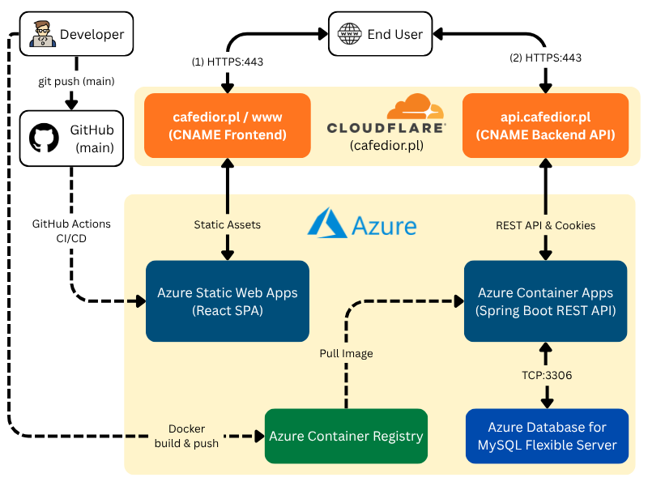

# CafeDior – Full-Stack Web Application Cloud Deployment (Microsoft Azure)

An academic engineering project focused on containerizing, orchestrating, and deploying a production-grade full-stack web application into the Microsoft Azure cloud infrastructure.

> **Cloud Status Notice:** The project was fully deployed, tested, and verified in a live Microsoft Azure environment (using an Azure for Students subscription with custom domain and DNS management). Cloud resources and domain routing have since been decommissioned to avoid ongoing infrastructure costs. This repository contains complete architectural documentation, CI/CD pipeline definitions, and a local Docker Compose environment mirroring production behavior.

---

## Architecture Overview

---

## About The Application

CafeDior is a restaurant management and table reservation platform designed to streamline booking workflows and menu presentation:

- Frontend: Responsive Single Page Application built with React, Vite, and Material UI (MUI).
- Backend: RESTful API built with Java 23 and Spring Boot, utilizing Spring Security and stateless JWT authentication stored in secure cookies.
- Persistence: Relational data layer running on MySQL 8.0 with Spring Data JPA/Hibernate.

---

## Cloud Architecture & Deployment (Microsoft Azure)

All production infrastructure was isolated within a dedicated Resource Group (cafe_dior):

### 1. Frontend: Azure Static Web Apps

- Static Hosting: High-performance static web hosting optimized for SPAs.
- Automated CI/CD: Integrated with GitHub Actions (azure-static-web-apps.yml). Pushes to main trigger dependency caching, production build (npm run build), and atomic artifact deployment.
- Routing Fallbacks: Configured staticwebapp.config.json with navigationFallback to index.html, eliminating 404 Not Found errors during direct URL access and client-side page refreshes (e.g., /signin, /reservation).

### 2. Backend: Azure Container Apps & Container Registry (ACR)

- Multi-Stage Containerization: Multi-stage Dockerfile leveraging Eclipse Temurin/Maven for compilation and an Alpine JRE base for runtime, significantly reducing image footprint and vulnerability exposure.
- Image Registry: Built images were versioned and published to Azure Container Registry (cafediorreg.azurecr.io).
- Serverless Execution: Deployed to Azure Container Apps with active HTTP ingress and dynamic scaling.
- Secret Management: Sensitive configuration parameters (database credentials, JWT secret keys, storage paths) were decoupled from source code, registered as Container App Secrets, and injected as environment variables at runtime.

### 3. Database: Azure Database for MySQL Flexible Server

- Managed Engine: MySQL 8.0 provisioned on the B1ms compute tier.
- Network Isolation: Enforced strict firewall access rules, allowing traffic exclusively from internal Azure service boundaries and authorized administration IPs.

### 4. Custom Domain, SSL & DNS Orchestration (Cloudflare)

- Domain Integration: Configured cafedior.pl to satisfy modern browser third-party cookie restrictions, ensuring HttpOnly, SameSite=None, and Secure authentication cookies flow reliably across front-end and back-end origins.
- DNS Delegation: Cloudflare handled DNS records and TLS edge routing:
  - cafedior.pl & www.cafedior.pl -> CNAME to Azure Static Web Apps.
  - api.cafedior.pl -> CNAME to Azure Container Apps ingress.
  - Ownership verified via custom TXT records.
- Container Ingress CORS: Strict CORS rules configured directly on Container Apps Ingress to authorize cross-origin requests, custom headers, and verbs from https://cafedior.pl.

---

## Local Replication (Docker Compose)

To inspect and run the system locally without active cloud subscriptions, the repository includes a Docker Compose environment that closely emulates the production setup with an Nginx reverse proxy and SSL encryption:

### Prerequisites

- Docker Engine & Docker Compose
- Local SSL certificates generated into ./cert/ (localhost+1.crt, localhost+1.key, localhost+1.p12)

### Quick Start

1. Clone the repository:
   `git clone https://github.com/aarekpp/CafeDior`
   `cd CafeDior`

2. Setup environment variables:
   `cp .env.example .env`

3. Build and run containers:
   `docker compose up -d --build`

4. Access local frontend application: https://localhost:3000

---

## Technologies Used

- Cloud & Infrastructure: Microsoft Azure (Static Web Apps, Container Apps, Container Registry, Azure Database for MySQL), Cloudflare DNS.
- DevOps & Containers: Docker, Docker Compose, Multi-stage Builds, Nginx Reverse Proxy, GitHub Actions CI/CD.
- Backend: Java 23, Spring Boot 3, Spring Security, Spring Data JPA, JWT, Hibernate.
- Frontend: React, Vite, Material UI (MUI), SCSS, Axios, Dayjs.
